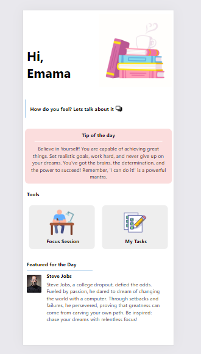
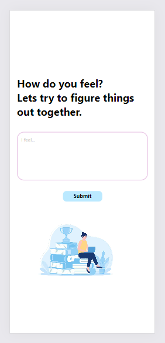
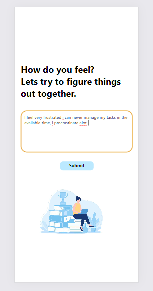
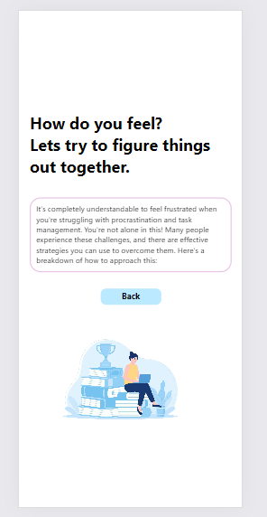
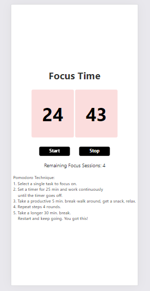
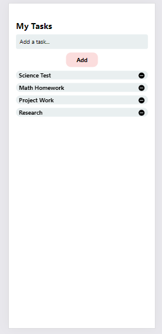

Study Partner is an app that helps anxious students and people in general with their daily tasks and morale.

It acheieves its purpose through features like:

1. Chatting with the user to solve any problems using AI.
2. Providing motivational tips.
3. Focus Sessions
4. To Do lists
5. Inspirational Stories
6. User Friendly Interface and Experience

**Technologies used:**
- React Native 
- Firebase
- Gemini API

**Screen Shots:**

**Home Screen:**

**AI Chat Screen:**

Ask or discuss anything:

Get help from AI:

**Focus Session Screen:**

Use the well known pomodoro method for fcous sessions to increaese work efficiency and focus:

**To do List Screen:**

Arrange your tasks with To Do List

